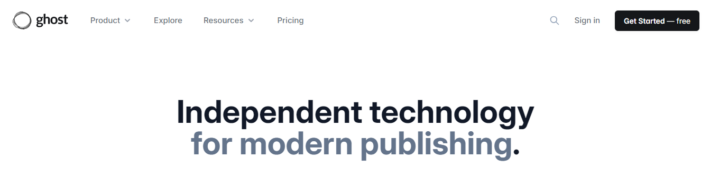
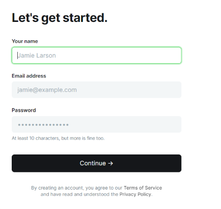
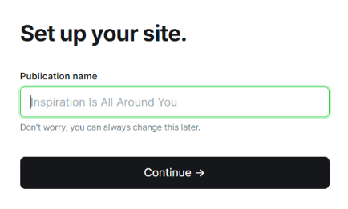
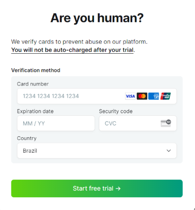

# Create an account

Let's create yours on Ghost:

- Go to [ghost.org](https://ghost.org/) and click the "Get started - free" to begin.

- Fill the form with your information and create a password

- Create a title for your account.

- Enter your banking details. These will be used to verify your identity and ensure a 14-day free trial, which can be canceled at any time.

> And don't worry ! You will not be billed when your trial expires, but to continue using Ghost(Pro) after your trial you will need to select a plan. For mor information about ghost's subscription click [here](https://ghost.org/help/manage-your-subscription/) ! 