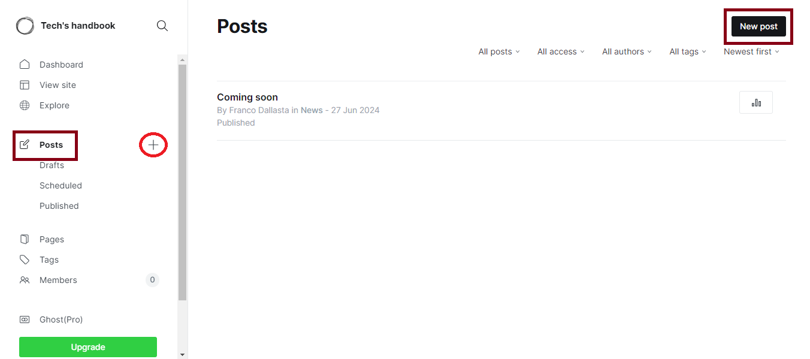
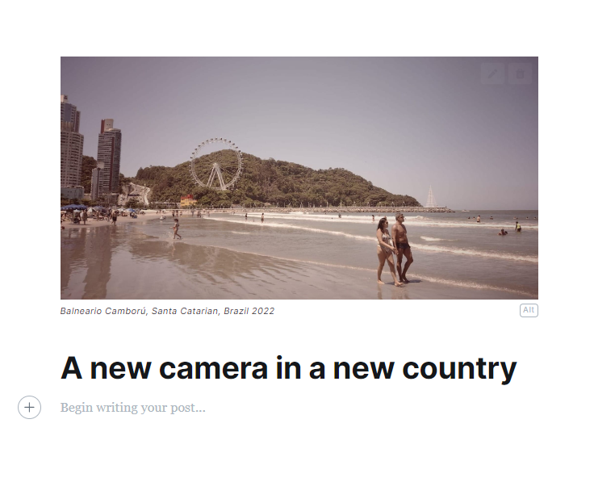
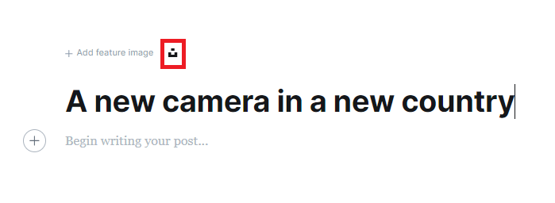
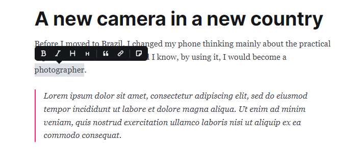
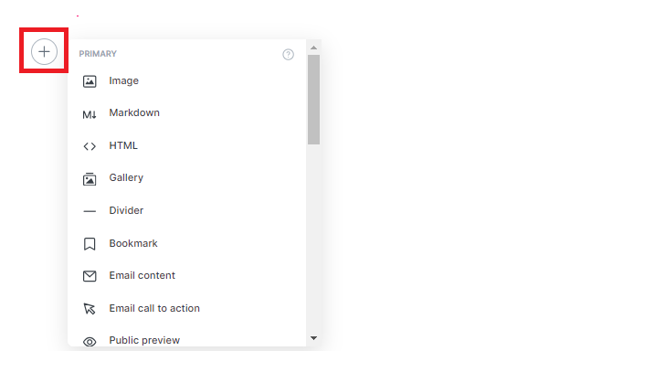
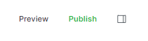
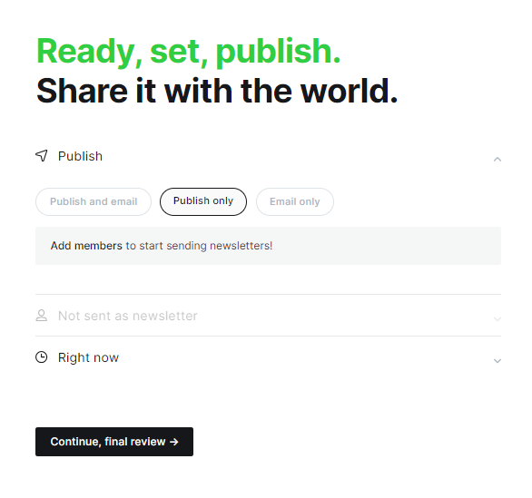
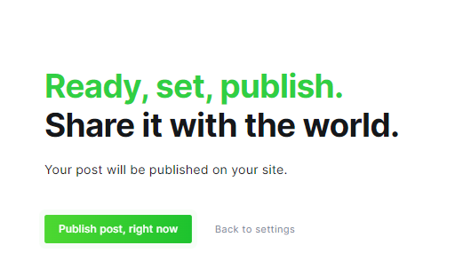

# Write your first post

- Click on  **Posts**  in the left sidebar and then click the  **New post**   button. Or you can simply click the  +  button next to **Posts**.

- Start by writing an engaging title and adding an image (if you wish) to convey the identity of your article.

💡 You can add an image from your devise or use one from [Unsplash](https://unsplash.com). It will allow you to use content from creators all over the world.

- Now is time to write. 

💡 The editor gives you basic options to convert the typography to italic, bold, or two header options. It also allows you to add hyperlinks and turn a block of text into a blockquote.

 

💡 Press this button to add any resource from this [list](https://ghost.org/help/cards/)

- Once you finish writing the article, it's time to publish. Press the publish button to continue.

- Next, a form will appear to configure the publication time and channel for the article. After that press the button to proceed to the final review.
 
 

 - Now you can publish your first article.

  

  Congratulation! You publish your first article. 